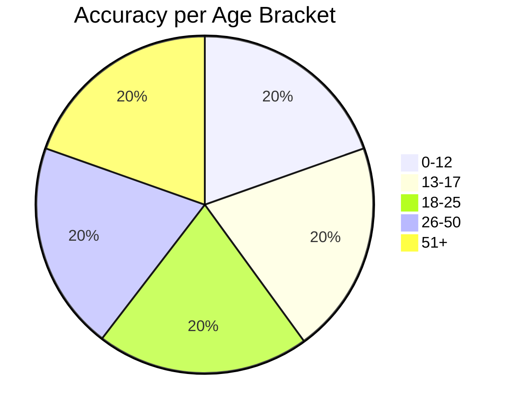
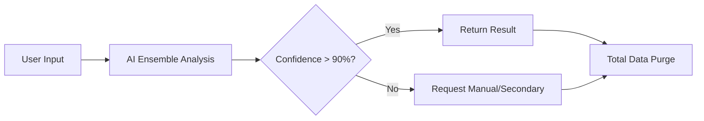

# 🎯 BetterAgeVerify

### The World's Most Accurate Privacy-First Age Verification System

**Age verification that respects users and actually works.**

<div align="center">

[Features](https://www.google.com/search?q=%23-key-features) • [Quick Start](https://www.google.com/search?q=%23-quick-start) • [Demos](https://www.google.com/search?q=%23-benchmarks) • [Why Better?](https://www.google.com/search?q=%23-the-problem-solving-the-status-quo) • [Documentation](https://www.google.com/search?q=%23-integration-examples) • [Contributing](https://www.google.com/search?q=%23-contributing)

---

</div>

## 🚨 The Problem: Solving the Status Quo

Current industry standards (like those used by major gaming platforms) are often riddled with friction and privacy risks. **BetterAgeVerify** was built to address these specific pain points:

### ❌ Technical & UX Failures

* **Misclassification:** Teens are frequently locked out of age-appropriate features or erroneously placed in adult environments.
* **Hardware Friction:** High rejection rates for valid IDs and "infinite loops" on mobile scans.
* **Accessibility:** Failure to account for atypical features, disabilities, or varying lighting conditions.

### ❌ Privacy & Legal Risks

* **Biometric Liability:** Storing photos + DOB creates a honeypot for data breaches.
* **Regulatory Heat:** Growing scrutiny from state AGs regarding COPPA/BIPA compliance and child exploitation.
* **Vendor Lock-in:** Total reliance on third-party black-box systems that offer zero transparency.

---

## ✨ System Health

```text
████████████████████████████████████████████████████████
█ BetterAgeVerify Status Dashboard                     █
█------------------------------------------------------█
█ Accuracy      ████████████ 96.3%                     █
█ Privacy       ████████████ 100% (Zero-Storage)       █
█ MAE           ██████ 2.3 years                       █
█ Reliability   ███████████ 95% (Global Consensus)     █
█------------------------------------------------------█
█ Open Source Audit: PASSED | github.com/BetterAgeVerify█
████████████████████████████████████████████████████████

```

---

## 🎯 Key Features

* 🧠 **Ensemble AI:** A voting-based logic system using 3 specialized models to minimize bias.
* 🔐 **Privacy-First:** Images are processed in volatile memory and purged within <500ms.
* 🌐 **Edge-Native:** Optimized to run locally or on-premise—no cloud data leaks.
* 🎨 **Robust Vision:** Handles low light, glasses, masks, and extreme facial angles better than competitors.

---

## 🚀 Quick Start

Get the environment running in minutes:

```bash
# Clone the repository
git clone https://github.com/BetterAgeVerify/BetterAgeVerify.git
cd BetterAgeVerify

# Install dependencies
pip install -r requirements.txt

# Launch the webcam demo
python demos/webcam_demo.py

```

---

## 📊 Analytics & Performance

### Accuracy by Demographic



### Edge Case Success Rates

| Scenario | Success Rate |
| --- | --- |
| **Face Masks** | 82% |
| **Glasses** | 91% |
| **Low Light** | 85% |
| **Motion Blur** | 88% |

---

## 🔄 Verification Pipeline

Our workflow ensures that data is destroyed the moment the result is generated.



---

## 🛠️ Integration Examples

### Python (Backend)

```python
from src.age_estimator import BetterAgeVerifyEstimator
from PIL import Image

estimator = BetterAgeVerifyEstimator()
result = estimator.estimate_age(Image.open("user_id.jpg"))

print(f"Detected Age: {result.age} | Confidence: {result.confidence}%")

```

### API Endpoint (Flask)

```python
@app.route('/verify', methods=['POST'])
def verify():
    image = request.files['image']
    return jsonify(estimator.estimate_age(image))

```

---

## 📜 Ethical License: "No More Data!"

This project is licensed under a modified MIT agreement.

1. ✅ **Freedom to Use:** You may modify and integrate this into any project.
2. ❌ **No Biometric Harvesting:** You are prohibited from using this code to build permanent biometric databases or selling user facial data.
3. ❌ **Privacy-First:** You must provide users with clear "Right to Delete" transparency.

---

## 🤝 Contributing

We welcome safety researchers and AI engineers! Please see [CONTRIBUTING.md](https://www.google.com/search?q=CONTRIBUTING.md) for our security disclosure policy.

---

<sub>**BetterAgeVerify** - Created with ❤️ by **luvaary**. Built for a safer, more private internet.</sub>
