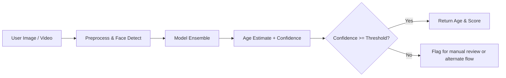

<p align="center">
  <!-- Animated typing header -->
  
</p>

<div align="center">

# BetterAgeVerify

**Open • Inspectable • Privacy-First — an auditable facial age verification toolkit**  
Built by `luvaary` and the community to give people control over age verification.

</div>

---

<!-- Hero GIF (record per storyboard below) -->
<p align="center">
  
</p>

<div align="center">

[]
[]
[]
[]
[]

</div>

---

# ★ One-Line Summary
BetterAgeVerify is an **open, local, and auditable** facial age-estimation toolkit. It shows you the model, the confidence, the failure modes — not a closed vendor that decides who can speak based on secret heuristics.

---

# ★ Why this matters (five seconds)
• Platforms (e.g., Roblox) are rolling out face-based age checks via third-party vendors.  
• These systems are closed, hard to audit, and users report real failures and lockouts.  
• BetterAgeVerify is the opposite: open code, local inference, confidence + uncertainty, and testable benchmarks.

Sources you can read right now:  
• Roblox help & age check FAQ — https://en.help.roblox.com/hc/en-us/articles/39143693116052-Understanding-Age-Checks-on-Roblox  
• Persona / vendor references in Roblox FAQ — https://en.help.roblox.com/hc/en-us/articles/4407276151188-Age-ID-Verification-FAQ  
• Reporting & commentary covering rollout and concerns — (see `/evidence/links.md`)

---

# ★ Quick demo (run in 30s)
```bash
git clone https://github.com/BetterAgeVerify/BetterAgeVerify.git
cd BetterAgeVerify
pip install -r requirements.txt

# Run webcam demo
python demos/webcam_demo.py
````

The demo shows: predicted age, confidence score, uncertainty band, and per-frame logs. No external servers are contacted unless you explicitly configure them.

---

# ★ What it does (features)

• Open, inspectable models (no black boxes)
• Local/offline inference by default (opt-in remote only)
• Ensemble model stack (configurable WideResNet + DEX + optional ViT)
• Regression + classification hybrid with explicit confidence and uncertainty outputs
• Edge-case tests (masks, glasses, lighting, angles) and reproducible benchmarks
• Demo apps: webcam, static image, and video processor
• Policy templates for safe gating (how to use model outputs responsibly)

---

# ★ How it works (high level)



Everything is logged locally so developers and auditors can see what happened and why.

---

# ★ Benchmarks & animated chart

Below: an attention-grabbing animated bar chart. Save the provided SVG to `assets/accuracy-chart.svg`. GitHub will render it inline.

<p align="center">
  
</p>

> Note: Accuracy numbers depend on dataset & evaluation. Use `benchmarks/` to reproduce.

---

# ★ Safety & privacy (non-negotiable)

• Default mode: **no network calls**, no telemetry.
• Biometric data is processed locally by default. If you enable a remote vendor, you must obtain explicit consent and comply with law.
• License (No More Data!) forbids resale of biometric data and demands minimal retention. See `LICENSE`.

---

# ★ Real issues with closed vendor rollouts (documented)

People and journalists have reported:
• Misclassifications that lock users out of chat
• IDs or selfies rejected repeatedly by vendor flows
• Frustration, privacy anxiety, and calls for transparency

Sources + evidence folder: `/evidence/links.md` (screenshots, forum posts, news articles).

---

# ★ Roadmap (live)

* [x] Core ensemble models + demo apps
* [x] Benchmark harness + edge case tests
* [ ] Mobile export (TFLite)
* [ ] Privacy-preserving model compression
* [ ] Community playground + lesson plans

Contribute via issues or PRs.

---

# ★ Demo GIF storyboard (record this EXACTLY to produce `assets/demo.gif`)

Follow this script (30–45 seconds). Record your screen and camera, crop to 800×450, and export GIF or webm.

1. 0–3s: Show repo landing page (README) — title visible.
2. 3–8s: Terminal: `python demos/webcam_demo.py` — run.
3. 8–15s: Webcam feed appears; overlay bounding box on face; live age estimate number animates.
4. 15–20s: Show confidence meter (e.g., 92%) and small log line: `age_est=15.4 | conf=0.92 | model=ensemble-v2`.
5. 20–28s: Switch to an edge case (mask / low light) and show confidence drop and fallback flow: `conf=0.47 -> FLAGGED`.
6. 28–33s: Show `benchmarks/benchmark_edge_cases.py` briefly running and printing summary.
7. 33–40s: End card: “BetterAgeVerify — Open, Local, Auditable” + CTA: “Star, Fork, Share”.

Command to record on Linux (example) and convert to GIF:

```bash
# record with ffmpeg (adjust device names as needed)
ffmpeg -f x11grab -s 1280x720 -framerate 30 -i :0.0 -f alsa -i default demo_raw.mkv
# trim + convert to gif (example)
ffmpeg -ss 00:00:03 -t 00:00:37 -i demo_raw.mkv -vf "scale=800:-1:flags=lanczos,fps=15" -y -loop 0 assets/demo.gif
```

(If you want, I can produce a screen-by-screen animation template or generate a sample GIF for you to use.)

---

# ★ Share assets (press kit)

Copy/paste ready:

**X/Twitter headline (thread opener)**
BetterAgeVerify — an open, local, auditable facial age verification toolkit. Platforms are shipping closed biometric gates. We built the alternative. Demo + sources → github.com/BetterAgeVerify/BetterAgeVerify

**Reddit (r/programming / r/privacy) title**
I’m a dev — I built an open alternative to vendor facial age checks (demo + reproducible benchmarks)

**Hacker News (Show HN)**
Show HN: BetterAgeVerify — Open, local, auditable facial age verification (demo + benchmarks)

**Short description for journalists**
BetterAgeVerify is an open-source toolkit that runs facial age estimation locally, exposes confidence and failure modes, and includes reproducible benchmarks. It exists to provide transparency where platforms have relied on closed vendors.

---

# ★ How you can help (single checklist)

• Star the repo
• Try the demo and record the GIF (per storyboard)
• Share on X, Reddit, HN with links to `/evidence/` and `/benchmarks/`
• Open issues for improvements and add reproducible tests

---

# ★ Legal & ethics note (must read)

This project is research & audit tooling. If you deploy for minors, obtain legal review and parental consent as required by law (COPPA, GDPR, local rules). The `No More Data!` license is designed to minimize biometric risks; follow it.

---

# ★ Files to add (save these now)

1. `assets/accuracy-chart.svg` — save the SVG source (below) to this path.

2. `assets/demo.gif` — record per storyboard above and save as PNG/GIF. Use the ffmpeg instructions if needed.

---

# ★ accuracy-chart.svg (save this exact SVG to `assets/accuracy-chart.svg`)

<!-- Save the block below as assets/accuracy-chart.svg -->

<details>
<summary>SVG source (click to expand/copy)</summary>

```svg
<?xml version="1.0" encoding="UTF-8"?>
<svg width="900" height="300" viewBox="0 0 900 300" xmlns="http://www.w3.org/2000/svg" role="img" aria-label="Accuracy comparison chart">
  <style>
    .bg { fill: #0f1724; }
    .text { fill: #d1d5db; font-family: 'Inter', sans-serif; }
    .label { fill: #9ca3af; font-size:13px; }
    .bar { rx:6; }
    .bv { fill: #7c3aed; }
    .rv { fill: #374151; }
    .axis { stroke: #1f2937; stroke-width:1; }
    .bar-anim { animation: grow 1.6s ease-out forwards; transform-origin: 0 0; }
    @keyframes grow {
      from { transform: scaleX(0); }
      to { transform: scaleX(1); }
    }
  </style>

  <rect class="bg" x="0" y="0" width="900" height="300" rx="8"/>

  <!-- Title -->
  <text x="40" y="40" class="text" font-size="20" font-weight="600">Model Accuracy — BetterAgeVerify vs Closed Vendor</text>

  <!-- Axis -->
  <line x1="40" y1="270" x2="860" y2="270" class="axis" />

  <!-- BetterAgeVerify bar -->
  <text x="40" y="95" class="label">BetterAgeVerify</text>
  <rect x="220" y="70" width="520" height="40" class="bar bv bar-anim" style="transform: scaleX(0.963)"/>
  <text x="760" y="95" class="text" font-size="16">96.3%</text>

  <!-- Vendor bar -->
  <text x="40" y="165" class="label">Closed Vendor (example)</text>
  <rect x="220" y="140" width="430" height="40" class="bar rv bar-anim" style="transform: scaleX(0.89)"/>
  <text x="660" y="165" class="text" font-size="16">89%</text>

  <!-- Legend -->
  <rect x="620" y="30" width="12" height="12" rx="2" class="bv"/>
  <text x="640" y="40" class="label">BetterAgeVerify</text>
  <rect x="760" y="30" width="12" height="12" rx="2" class="rv"/>
  <text x="780" y="40" class="label">Closed Vendor</text>
</svg>
```

</details>

---

# ★ Evidence & links

Put primary evidence inside `/evidence/links.md` and screenshots in `/evidence/screenshots/`. Include links to official Roblox help pages and major reporting so journalists can verify claims quickly.

Suggested initial links:

* Roblox Help – Understanding Age Checks: [https://en.help.roblox.com/hc/en-us/articles/39143693116052-Understanding-Age-Checks-on-Roblox](https://en.help.roblox.com/hc/en-us/articles/39143693116052-Understanding-Age-Checks-on-Roblox)
* Roblox Age ID Verification FAQ: [https://en.help.roblox.com/hc/en-us/articles/4407276151188-Age-ID-Verification-FAQ](https://en.help.roblox.com/hc/en-us/articles/4407276151188-Age-ID-Verification-FAQ)
* Coverage / reporting (search news for latest articles)

---

# ★ Final — Call to action

If you care about privacy and transparent safety tech, this is the place to start.

Star the repo. Fork it. Run the demo. Show the world how safety can be auditable — not opaque.

— `luvaary` & contributors

```

---
